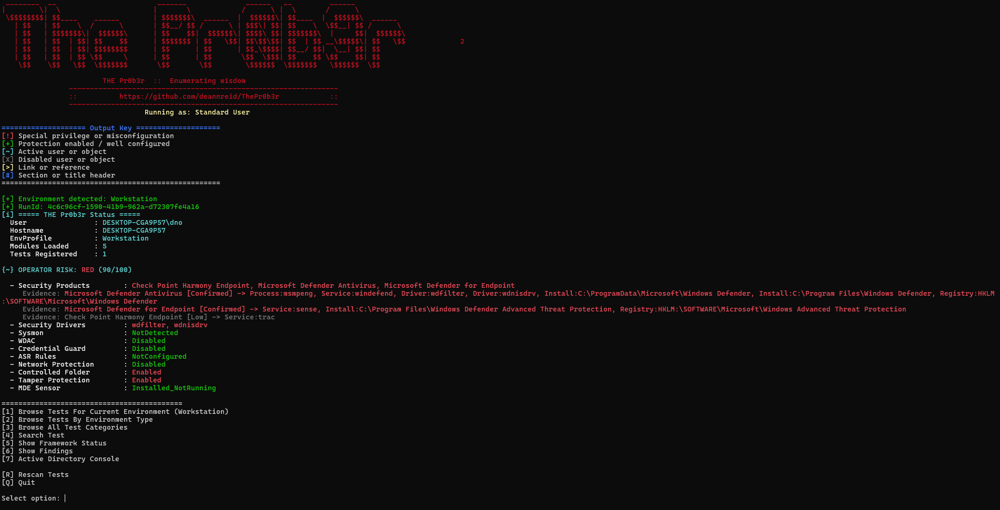
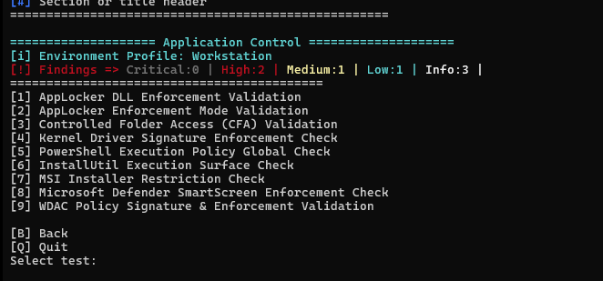
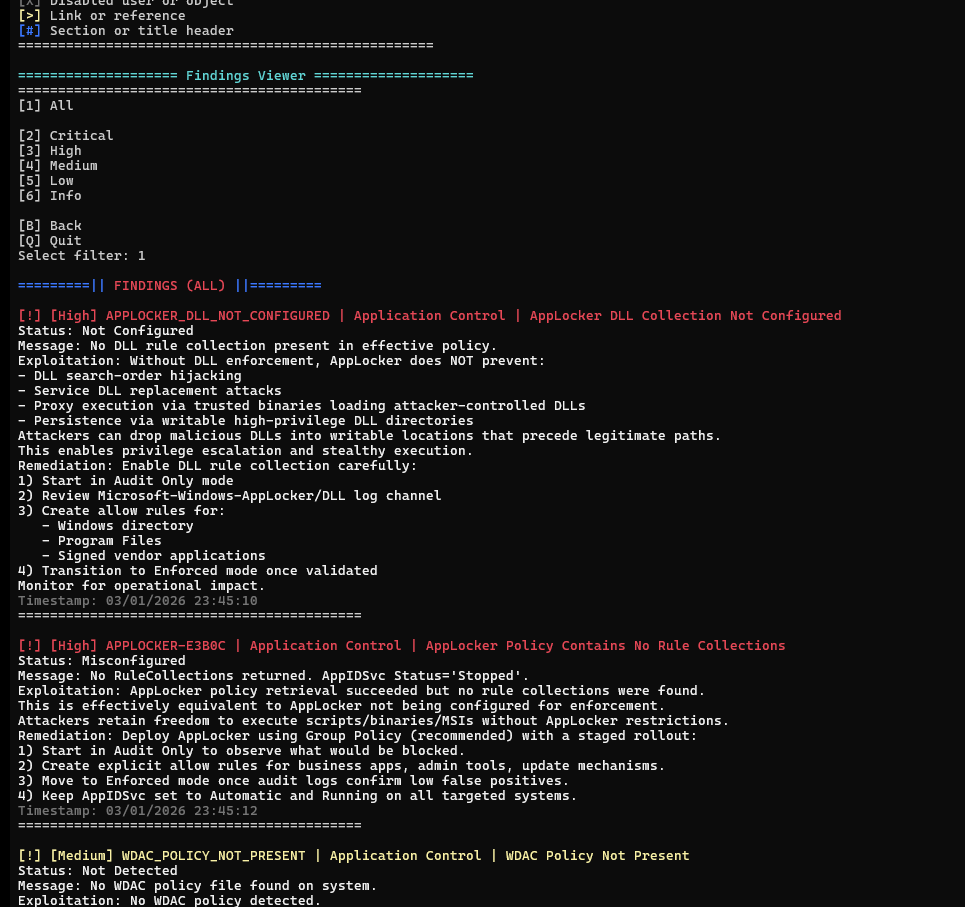

# THE Pr0b3r


> Modular Windows security enumeration for people who actually use their tools.

---

# What Is This?

**THE Pr0b3r** is a modular Windows security assessment framework built around:

* A structured **test registry**
* Operator-first console output
* Clean, deduplicated findings
* Mapping-aware reporting (MITRE / CWE / NIST)

It’s not a “run everything and dump chaos” script.

It’s a framework.

---

# Version 2 Architecture

The new framework introduces:

* 🔎 Dynamic test discovery
* 🧱 Structured `test.json` schema
* 🗂 Category objects with Primary + Subcategories
* 🧠 Built-in MITRE / CWE / NIST mapping support
* 📊 Deterministic finding IDs
* 🔌 Drop-in plugin model
* 🧪 Single-responsibility tests

Each test is standalone, structured, and predictable.

---

# Design Philosophy

* StrictMode safe
* Fail gracefully
* No silent crashes
* Findings > raw output
* Operator clarity > noise
* Prevention ≠ detection
* Audit mode ≠ enforcement

---

# Framework Overview

## 🔍 Test Discovery

Tests are automatically discovered from disk:

```
Tests/<Scope>/<Category-TestName>/
├── test.json
├── test.ps1  OR  test.psm1
```

Drop the folder in.
It registers automatically.

No central registry file to edit.

---

## 🧩 JSON Test Structure

Every test must include a `test.json` file.

Example:

```json
{
  "SchemaVersion": 5,
  "Id": "DEMO-WEAK-SERVICE-PERMISSIONS",
  "Name": "Demo Weak Service Permission Check",
  "Function": "fncDemoTestTemplate",

  "Category": {
    "Primary": "Privilege Escalation",
    "Subcategories": [
      "Service Misconfiguration",
      "Access Control Weakness"
    ]
  },

  "Scopes": ["Workstation", "Server"],
  "RequiresAdmin": false,
  "Enabled": true,

  "Description": "Checks for services where non-admin users may modify configuration.",

  "Mappings": {
    "MitreAttack": [...],
    "CWE": [...],
    "Nist": [...]
  }
}
```

---

## Required Fields

* `SchemaVersion`
* `Id`
* `Name`
* `Function`
* `Category.Primary`
* `Scopes`

---

## Optional (But Strongly Recommended)

* `Subcategories`
* `Description`
* `Mappings` (MITRE / CWE / NIST)
* `RequiresAdmin`
* `Enabled`

---

# Scopes

Scopes control menu visibility.

| Scope       | Purpose                         |
| ----------- | ------------------------------- |
| Workstation | Endpoint baseline / local abuse |
| Server      | Service exposure / config risk  |
| Domain      | AD / delegation / Kerberos      |
| DMZ         | Boundary / externally exposed   |
| All         | Always eligible                 |

`All` simply means “visible everywhere”.

---

# Findings Framework

All tests write to a central findings object.

Standard structure:

* `TestId`
* `Id`
* `Category`
* `Title`
* `Severity`
* `Status`
* `Message`
* `Recommendation`
* `Exploitation`
* `Remediation`
* `Timestamp`

---

## Severity Levels

* `Info`
* `Low`
* `Medium`
* `High`
* `Critical`

Severity must reflect:

* Exploitability
* Privilege context
* Impact
* Ease of abuse

---

## Deterministic Finding IDs

Use fingerprint-based hashing:

```powershell
$fingerprint = "$ServiceName|$Path|$Context"
$tag = fncShortHashTag $fingerprint

fncAddFinding -Id ("PRIVESC_SVC_$tag") ...
```

Benefits:

* Stable across runs
* Deduplicated
* Not unreadable GUID spam

---

# Console Output Standards

Every test should:

1. Print a section header
2. Print what it is checking
3. Print intermediate states
4. Print result summary

Use:

* `fncPrintSectionHeader`
* `fncPrintMessage`
* `fncAddFinding`

Console output is for operators.
Findings are for reporting.

They are not the same thing.

---

# Writing Tests (Schema V5 Style)

## 1️⃣ Create Folder

```
Tests/Workstation/Privilege Escalation-Weak Service Permissions/
```

Recommended naming:

```
<Category>-<TestName>
```

---

## 2️⃣ Add `test.json`

Must match function name in script.

---

## 3️⃣ Add `test.psm1`

Structure:

```powershell
function fncExampleTest {

    fncPrintSectionHeader "Example Test"
    fncPrintMessage "Checking example condition..." "info"

    $testId = "EXAMPLE-TEST-ID"

    # Logic here...

    fncAddFinding `
        -TestId $testId `
        -Id "EXAMPLE_FINDING_1" `
        -Category "Example Category" `
        -Title "Example Finding" `
        -Severity "High" `
        -Status "Detected" `
        -Message "Condition detected." `
        -Recommendation "Fix it properly." `
        -Exploitation "Explain realistic abuse path." `
        -Remediation "Explain exact remediation steps."
}

Export-ModuleMember -Function fncExampleTest
```

---

# AD Test Notes

Expect:

* No RSAT
* No Kerberos
* No domain join
* Partial connectivity

Use:

* `fncEnsureADAuth`
* `fncEnsureKerberos`
* `fncADQuery`

Fail gracefully.
Create useful findings instead of crashing.

---

# Debugging

Enable debug:

```powershell
$global:config.DEBUG = $true
```

Message levels:

* success
* info
* warning
* error
* debug

---

# What This Is Not

* Not a scanner
* Not an EDR
* Not a “press button get DA” script **(Yet!)**

It’s a structured operator framework.

---

# Requirements

* Windows PowerShell 5.1+
* PowerShell 7 supported
* Some tests require admin

Optional dependencies should never break the framework.

---

# Legal

Only run this where you are authorised.

Be professional not a douche'.

---

# Project

THE Pr0b3r
Built by Dean

Repo:
[https://github.com/deannreid/ThePr0b3r](https://github.com/deannreid/ThePr0b3r)

---

## 📸 Screenshots



---





---